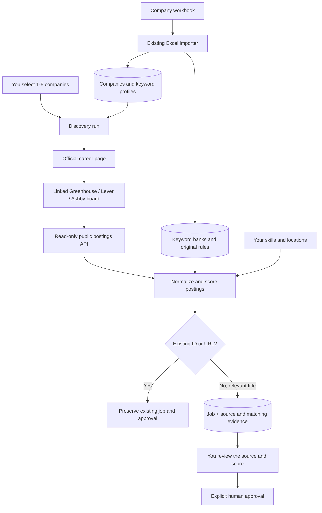

# Phase 2: a small, manually triggered discovery pilot

[Project overview and all phases](../README.md) | [Previous: Phase 1 foundation](PHASE1.md)

Phase 2 extends Phase 1. The Excel importers, tracking endpoints, twelve job fields, duplicate protection, and human approval checks remain available. See the Phase 1 guide for those features and their original verification history. Commands in this guide run from the project root.

Phase 2 reads public job postings from **Greenhouse, Lever and Ashby**, using only board links or embeds found on the official career pages imported from your workbook. It does not guess company board IDs. Pages requiring JavaScript execution, custom careers systems, pages with multiple distinct boards, or pages without a supported board link are reported as unsupported. No login, CAPTCHA bypass, application submission, résumé generation, scheduling or n8n is included.

## Data flow



## Start or upgrade (PowerShell)

```powershell
Set-Location 'D:\OFFICIAL WORK\PROJECTS\Somnath Da\Job_Pipeline'
if (-not (Test-Path .env)) { Copy-Item .env.example .env }
docker desktop start
docker compose config --quiet
```

For an existing Phase 1 database, back it up before upgrading. The following avoids PowerShell binary redirection, which can corrupt a custom-format PostgreSQL dump in older PowerShell versions:

```powershell
New-Item -ItemType Directory -Force backups | Out-Null
docker compose exec -T db sh -c 'pg_dump -U "$POSTGRES_USER" -d "$POSTGRES_DB" -Fc -f /tmp/job_pipeline_backup.dump'
if ($LASTEXITCODE -ne 0) { throw 'Database backup failed' }
$backupFile = 'backups/job_pipeline_' + (Get-Date -Format 'yyyyMMdd_HHmmss') + '.dump'
docker compose cp db:/tmp/job_pipeline_backup.dump $backupFile
if ($LASTEXITCODE -ne 0) { throw 'Backup copy failed' }

docker compose up --build -d --wait
Invoke-RestMethod 'http://localhost:8000/health'
Start-Process 'http://localhost:8000/docs'
```

For a fresh database, skip the backup commands and run `docker compose up --build -d --wait` directly. Startup runs Alembic migrations before serving requests. Migration `0001` adopts the original three-table Phase 1 schema or creates it on a fresh database. Migration `0002` adds three tables: `matching_profiles`, `discovery_runs`, and `job_evidence`. The twelve tracker fields and existing company/job data are preserved. Destructive downgrade commands are intentionally disabled.

The database backup made during development is `backups/phase1-before-phase2.dump`, excluded from Git. To inspect a backup without restoring it:

```powershell
docker compose cp backups/phase1-before-phase2.dump db:/tmp/check-backup.dump
docker compose exec -T db pg_restore --list /tmp/check-backup.dump
```

To restore into a **separate new database** for inspection, leaving the active database alone:

```powershell
docker compose exec -T db sh -c 'createdb -U "$POSTGRES_USER" job_pipeline_restore_check'
if ($LASTEXITCODE -ne 0) { throw 'Choose a new restore database name; do not overwrite an existing database' }
docker compose exec -T db sh -c 'pg_restore --exit-on-error --no-owner -U "$POSTGRES_USER" -d job_pipeline_restore_check /tmp/check-backup.dump'
if ($LASTEXITCODE -ne 0) { throw 'Restore failed; inspect pg_restore output' }
```

The application continues using its configured database. Switch `DATABASE_URL` only when you intentionally want to use the restored copy.

## Run a discovery pilot

Import the company source if you have not already done so, then select CloudSEK by name. Never hardcode a database ID from another installation.

```powershell
$base = 'http://localhost:8000'
Invoke-RestMethod -Method Post "$base/imports/companies"
$companies = Invoke-RestMethod "$base/companies?limit=500"
$company = $companies | Where-Object { $_.name -eq 'CloudSEK' }
if (-not $company) { throw 'CloudSEK was not found in the imported companies' }

# Review the default workbook-based candidate profile.
Invoke-RestMethod "$base/matching-profile" | ConvertTo-Json -Depth 5

$request = @{
    company_ids = @([int]$company.id)
    max_jobs_per_company = 100
} | ConvertTo-Json
$run = Invoke-RestMethod -Method Post "$base/discovery/runs" -ContentType 'application/json' -Body $request -TimeoutSec 600
$run | ConvertTo-Json -Depth 8

$jobs = Invoke-RestMethod "$base/jobs?company=CloudSEK&status=New&min_match_score=40&limit=100"
$jobs | Format-Table job_id, role, location, match_score, status
if ($jobs.Count -gt 0) {
    $jobId = $jobs[0].job_id
    Invoke-RestMethod "$base/jobs/$jobId/discovery" | ConvertTo-Json -Depth 10
}
```

Discovery is synchronous. Each company has a 90-second fetch budget, 20-request cap, 12-second request timeout, and 8 MB decoded response limit. Select 1–5 companies, with 1–300 postings per company (default 100). Lever is paginated; Greenhouse/Ashby return a board list which is then capped. `truncated=true` explicitly marks incomplete coverage. Raise the cap on a later run when appropriate; the pilot does not provide resume cursors for boards larger than 300 postings.

For official HTML career pages, the fetcher checks robots.txt, including bounded redirects to the same host/www alias. Page redirects are limited to the official host/www variant and recognized board hosts. All requests require public HTTPS addresses and private-network destinations are blocked. Documented public postings API calls use only known provider API hosts and do not depend on those hosts serving robots.txt (for example, Ashby's unrelated robots route returns 401). A denial from a requested posting endpoint is still reported as a failure. The client retries 429/5xx once with a bounded Retry-After delay. Corporate proxy environment variables are not used by the fetcher.

## Matching behavior

The default skills and India locations use the workbook profile, approved for this pilot. Redis and Kafka remain adjacent/learning skills. Change these settings when your experience changes:

```powershell
$profile = Invoke-RestMethod "$base/matching-profile"
$profile.demonstrated_skills = @('Python', 'FastAPI', 'SQL', 'PostgreSQL', 'Docker', 'Linux')
$profile.adjacent_skills = @('Redis', 'Kafka')
$profile.locations = @('India', 'Bengaluru', 'Bangalore', 'Kolkata', 'Hyderabad', 'Pune', 'Gurugram', 'Gurgaon', 'Noida', 'Chennai', 'Mumbai', 'Delhi')
$profile.max_experience_years = 2
Invoke-RestMethod -Method Put "$base/matching-profile" -ContentType 'application/json' -Body ($profile | ConvertTo-Json)
```

PUT replaces the profile; omitted fields return to defaults. Each run saves the exact candidate profile used, and each job saves the score weights and explanation used at discovery time. Profile changes affect future discovery only; they do not silently rewrite existing scores or approval decisions.

| Check | Pilot behavior |
| --- | --- |
| Title | Must contain a role phrase from that company's DATA keywords; unrelated titles are counted and skipped. |
| Demonstrated skills | Keyword mentions in the posting are compared with your declared skills. |
| Experience | Numeric years and early-career title wording provide heuristic evidence; ambiguous or missing information requires review. |
| Location | Matches only the posting's location fields, not a company address mentioned in the description. Generic “Remote” does not prove India eligibility. |
| Exclusions | Company EXCLUDE terms are applied; seniority words are matched in the title to avoid phrases like “work with senior engineers.” Other exclusions are checked in title/description. |
| Missing profile | Companies without workbook keyword profiles are skipped with a clear reason. |

The DATA sheet's numeric weights are read from stored workbook rules: title 35, demonstrated skills up to 30 (up to five skills), experience 20, location 15, exclusion -100 in the supplied workbook. AI/Cyber use the same common baseline plus a pilot adjacent bonus of 2 points each, capped at 10; total score is capped at 100. This makes the partly narrative workbook rules executable without pretending every sentence is a formal algorithm. AI's adjacent bonus follows its stated numeric rule; Cyber uses that same explicitly documented pilot default.

Relevant jobs with exclusion, experience or location mismatches are saved as **Rejected**, score 0, with the reason. Other relevant jobs are saved as **New**, with review flags. Jobs without enough evidence can still have a partial score; a high score is not authorization to apply. Work authorization always needs human verification.

Descriptions and detected skill mentions are available in `/jobs/{job_id}/discovery`. The `required_skills` and `missing_skills` tracker fields remain empty for discovered jobs: a keyword mention alone does not prove that a skill is a requirement. The evidence exposes `skill_mentions`, `demonstrated_skill_matches`, `adjacent_skill_matches`, and `skills_to_review` instead.

## Duplicates and approval

Discovered Job IDs are stable hashes of company ID, provider, board and posting ID. Provider URLs have recognized tracking parameters (`utm_*`, `gh_src`, `lever-source`, `lever-origin`) and fragments removed before storage. Identity parameters such as `gh_jid` and other unknown parameters are preserved. A repeated ID or exact canonical URL skips the record. Existing manual/Excel URLs with tracking parameters retain Phase 1's exact-string behavior and may need manual normalization.

Repeated discovery does not overwrite an existing job, score, status, description or human approval. The pilot records newly discovered jobs, not a full refresh/closed-job synchronization. All new jobs have `human_approval=false`. The Phase 1 database and API approval constraints still apply. You can manually reconsider a Rejected job after reading the evidence; Approved still requires explicit human approval.

## New endpoints

| Method | Endpoint | Purpose |
| --- | --- | --- |
| GET / PUT | `/matching-profile` | Inspect or replace the pilot candidate profile |
| POST | `/discovery/runs` | Discover jobs for selected imported company IDs |
| GET | `/discovery/runs` | Paginated run history (`limit`, `offset`) |
| GET | `/discovery/runs/{run_id}` | Per-company outcomes and source errors |
| GET | `/jobs/{job_id}/discovery` | Source description and matching explanation |

Check `status`, `errors`, and `truncated`, not just HTTP status. A POST returns a persisted run with status `completed`, `partial`, or `failed`. The per-company counts distinguish created jobs, duplicates, irrelevant titles, exclusions, and jobs requiring review. No background queue exists yet; terminating the process during a run can leave its status `running` until the next API startup marks it interrupted. Run a single API process for this pilot; multi-worker scheduling/recovery is not implemented.

## Tests and local Python

```powershell
.\.venv\Scripts\python.exe -m pip install -r requirements.txt
.\.venv\Scripts\python.exe -m pytest -q
docker compose run --rm -e TEST_POSTGRES=1 api python -m pytest -q -p no:cacheprovider
```

Network tests use fixture responses, so results do not depend on live listings. Tests cover all three provider formats, pagination, HTML embeds, bounded retries, robots restrictions, private-host rejection, title/skill/experience/location gates, approval preservation, run history, and migration preservation. PostgreSQL tests use isolated schemas and leave the application's public tables alone.

To run the API directly after stopping the container API:

```powershell
docker compose stop api
.\.venv\Scripts\python.exe -m app.migrate
.\.venv\Scripts\python.exe -m uvicorn app.main:app --reload
```

## Provider references

- [Greenhouse Job Board API](https://docs.greenhouse.io/job-board.html)
- [Lever Postings API](https://github.com/lever/postings-api/blob/master/README.md)
- [Ashby public job postings API](https://developers.ashbyhq.com/docs/public-job-posting-api)

The next phase can add a review dashboard, better source coverage and reviewed matching refinements. Scheduling should follow only after the pilot's sources and match explanations are satisfactory.

## Verification performed on 2026-09-27

- **73 tests passed** in Docker with SQLite and PostgreSQL, including the query-parameter identity regression test. One existing Starlette/AnyIO deprecation warning remains.
- Compose configuration validated and both services became healthy. Alembic revision is `0002`; all **440 original companies** were retained.
- CloudSEK's official page resolved its Greenhouse script embed: **15 postings fetched**, all skipped by the workbook title gate.
- Cohere's official page resolved its Ashby board: **100 postings fetched**, **12 title-relevant jobs saved as Rejected** with explanations, and 88 unrelated titles skipped. The run is marked **partial/truncated** because it reached the 100-posting pilot cap. These are not approved recommendations.
- Repeating the Cohere run created **0 jobs** and reported **12 duplicates**. All discovered jobs retain `human_approval=false`.
- A pre-migration database backup was saved under `backups/`. The services remain running at API port 8000 and PostgreSQL host port 55432.
