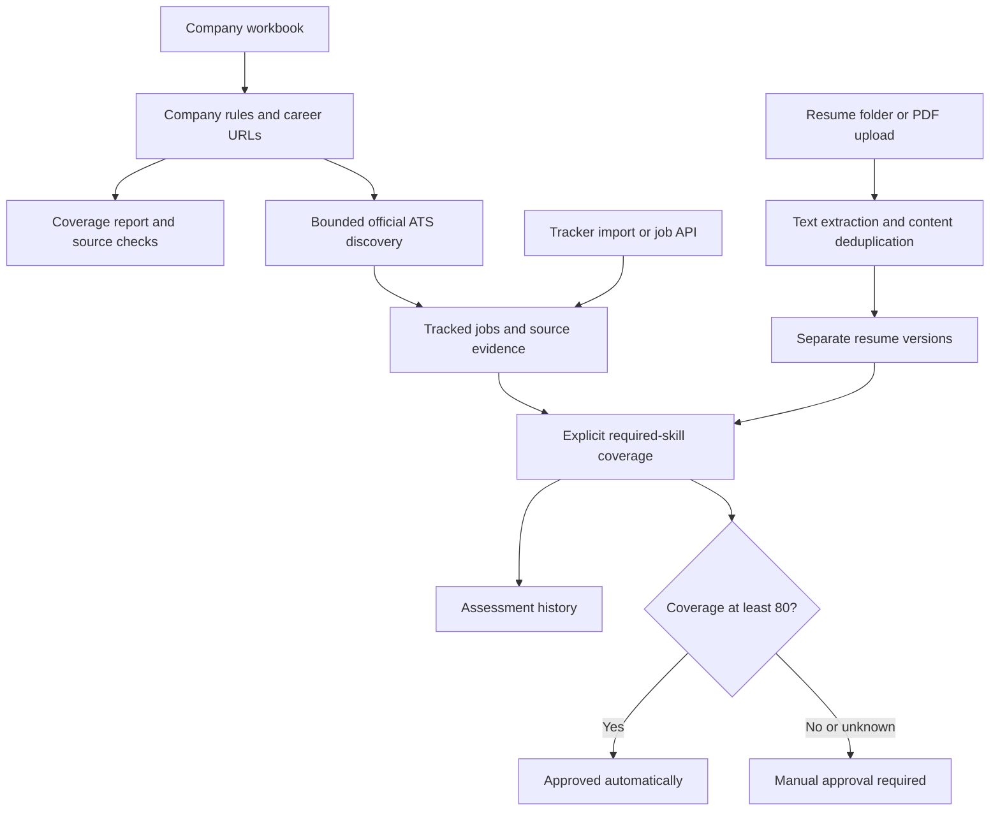

# Phase 3 — Coverage and résumé matching

[Project overview](../README.md) · [Phase 1](PHASE1.md) · [Phase 2](PHASE2.md)

Phase 3 extends the existing application. It adds résumé versions, explicit skill-coverage calculations, automatic approval at **80% or above**, source coverage reports, and continuation for large job boards. It does not submit applications. The earlier human-only approval policy is superseded by the rule described here.

## What we do, and why

| Step | Implementation | Reason |
| --- | --- | --- |
| Read local résumés | Extract text from each PDF using pypdf | Match your actual résumé content instead of assuming the workbook profile is a résumé |
| Keep independent versions | SHA-256 content ID, filename and extracted text in PostgreSQL | Skip identical files; preserve changed versions; never combine skills from several résumés into an imaginary résumé |
| Identify requirements | Explicit tracker Required Skills or a clearly labeled `Required skills:` / `Mandatory skills:` list in a discovered description | General technology mentions and preferred skills are not necessarily requirements |
| Calculate coverage | Unique required skills found in one résumé / all unique required skills × 100 | A reproducible calculation with matched and missing terms |
| Apply approval policy | At least 80 → Approved automatically; lower/unknown → manual approval needed | Implements the requested threshold without pretending a person reviewed an automatic decision |
| Store evidence | Append assessment records with selected résumé, requirements, matches, missing terms, score and policy version | Explain decisions and retain earlier calculations |
| Audit discovery coverage | Report missing company profiles and URLs; optionally resolve selected sources | Show where the workbook needs correction without inventing company rules |
| Continue larger boards | `job_offset` and per-company `next_offset` | Reach jobs beyond the original first-page cap |
| Refine matching | SDE/full-stack aliases and country-restricted remote interpretation | Recognize common titles; Remote–US does not establish India eligibility |
| Preserve the foundation | Alembic migration 0003 and regression tests | Keep Phase 1/2 data and APIs available |

## Score and approval meaning

The existing 12 tracker business fields and API response remain unchanged. `match_score` is still the Phase 2 workbook suitability heuristic. It is **not** the new résumé percentage. Database-only `resume_match_percent` and `auto_approved` columns support the new gate, and dedicated endpoints expose the approval evidence.

Example: required skills `Python, SQL, Docker, Linux, Java`; a résumé mentions the first four → 4/5 = **80%**, therefore automatic approval. A missing résumé or missing requirements produces **unknown**, not 100%. Comparison uses the unrounded percentage. A manually supplied `match_score=100` cannot unlock approval.

By default, compare all imported versions independently and choose the highest coverage; ties use the stable content ID. You can select one résumé with `resume_id` when reassessing. Automatic approval records its filename and content-ID prefix in `resume_version`, with `human_approval=false`. Manual approval still uses the existing PATCH endpoint with `human_approval=true`.

This percentage measures **textual required-skill coverage**, not a semantic match to every aspect of a job profile or a probability of getting hired. It does not verify proficiency, years of experience, education, work authorization, or location. Phase 2 warnings remain available in discovery evidence. Under the requested threshold rule, those warnings do not veto an available score of at least 80. The discovery relevance filter still determines which postings are stored.

Requirements should contain one skill per comma, semicolon or newline. Aliases such as React/React.js are deduplicated. Free prose, alternatives such as “Python or Java,” and unstated requirements are not interpreted semantically. Discovered jobs without a clear machine-readable list stay pending (or retain the Phase 2 exclusion result) until requirements are supplied or a person approves. Review the requirement list before relying on a score. PDF extraction is text-only; scanned résumés need OCR outside this phase.

## Data flow



## Technologies and alternatives

Python keeps imports, discovery and matching in one language; FastAPI exposes validated APIs and interactive documentation; SQLAlchemy handles database access; PostgreSQL stores durable shared state; Alembic upgrades existing databases; Docker Compose runs the API and database consistently. These continue from Phases 1/2.

New: **pypdf** reads text locally without sending résumés to an external service. pdfplumber is an alternative for layout-heavy documents; OCR would be necessary for scanned pages. SHA-256 identifies file content without relying on filenames. Deterministic term matching is easy to explain and test; embeddings or an LLM could interpret prose better, but would need a labeled evaluation set, privacy decisions and calibrated thresholds before replacing this percentage. pytest covers policy boundaries and API integration; SQLite speeds up tests and isolated PostgreSQL schemas check production-database behavior.

## Start or upgrade — PowerShell

Use the Phase 2 backup instructions before upgrading an existing database. Migration 0003 retains jobs, companies and discovery history, adds résumé/assessment tables, and changes the database approval constraint. Startup applies migrations automatically. Restore a backup to roll back; destructive downgrade is intentionally unsupported.

```powershell
Set-Location 'D:\OFFICIAL WORK\PROJECTS\Somnath Da\Job_Pipeline'
if (-not (Test-Path .env)) { Copy-Item .env.example .env }
New-Item -ItemType Directory -Force resume | Out-Null
docker compose config --quiet
docker compose up --build -d --wait
$base = 'http://localhost:8000'
Invoke-RestMethod "$base/health"
Start-Process "$base/docs"
Invoke-RestMethod -Method Post "$base/imports/resumes"
Invoke-RestMethod "$base/resumes"
```

The folder is mounted read-only into Docker. PDFs are excluded from Git and the Docker image. Their extracted text is stored in the local database and therefore included in database backups. All files here are assumed to be versions for one user; multi-user identity separation is not implemented.

## Add a new résumé later

Copy a PDF into `resume/`, then run the same import again:

```powershell
Invoke-RestMethod -Method Post 'http://localhost:8000/imports/resumes'
Invoke-RestMethod 'http://localhost:8000/resumes'
```

It scans every PDF, imports new content, skips identical content, and reports unreadable files individually. A changed PDF—even with the same filename—becomes a new version. Nothing needs restarting. This is an explicit rescan, not a background folder watcher. Removing a file from disk does not remove its imported database version.

Alternatively, open `/docs`, choose **POST /imports/resumes**, click **Try it out**, select a PDF in the optional `file` input, and execute. PowerShell can upload with Windows curl:

```powershell
$resumePath = 'D:\OFFICIAL WORK\PROJECTS\Somnath Da\Job_Pipeline\resume\Soumyodeep_Dey_AI_Full Stack.pdf'
curl.exe -X POST 'http://localhost:8000/imports/resumes' -F "file=@$resumePath;type=application/pdf"
```

Uploads go directly into the database as text and do not write a PDF into the mounted folder. Limits: 10 MB, 20 pages, unencrypted PDF, at least 100 extractable text characters.

## Evaluate a tracked job

New jobs from the API/Excel automatically receive an assessment. Discovery does the same when it finds an explicit required-skills list. Duplicates remain unchanged. Adding a résumé does not retroactively change existing job decisions.

For an existing job, use its actual ID and copy its required skills accurately from the description:

```powershell
$base = 'http://localhost:8000'
$jobs = Invoke-RestMethod "$base/jobs?limit=10"
$jobs | Format-Table job_id, role, status
$jobId = $jobs[0].job_id  # Choose the job you intend to reassess.
$body = @{ required_skills = 'Python, SQL, Docker, Linux, Java' } | ConvertTo-Json
Invoke-RestMethod -Method Post "$base/jobs/$jobId/resume-assessment" -ContentType 'application/json' -Body $body
Invoke-RestMethod "$base/jobs/$jobId/approval"
Invoke-RestMethod "$base/jobs/$jobId/resume-assessments"
```

Omit `required_skills` to retain the existing requirements; send `{}` to select the best imported résumé. To choose one version, include `resume_id` from GET /resumes. Reassessment may move an automatically Approved job back to New if its new score falls below 80. Explicit reassessment can also reconsider a Rejected job. Human approvals and later application outcomes (Applied, Interview, Offer, Withdrawn) are not overwritten. Manually moving an automatically approved job to another status clears its automatic approval; it cannot be switched back to Approved without reassessment or human approval.

Manual approval below the threshold:

```powershell
$body = @{ status = 'Approved'; human_approval = $true } | ConvertTo-Json
Invoke-RestMethod -Method Patch "$base/jobs/$jobId" -ContentType 'application/json' -Body $body
```

## Coverage and continuation

```powershell
Invoke-RestMethod "$base/discovery/coverage?limit=500"
$companies = Invoke-RestMethod "$base/companies?limit=10"
$companyId = $companies[0].id  # Select the company you want to inspect.
$body = @{ company_ids = @($companyId) } | ConvertTo-Json
Invoke-RestMethod -Method Post "$base/discovery/source-audits" -ContentType 'application/json' -Body $body
$body = @{ company_ids = @($companyId); max_jobs_per_company = 100; job_offset = 0 } | ConvertTo-Json
$run = Invoke-RestMethod -Method Post "$base/discovery/runs" -ContentType 'application/json' -Body $body
$run.results | Format-List
```

If `next_offset` is non-null, use that value for the next `job_offset` for that company. Run companies individually when their continuation offsets differ. Limits remain 1–5 companies and 1–300 jobs per company per request; no unbounded crawl was added. Boards can change order between requests, so offsets are not snapshot cursors; duplicate protection helps, but a fresh run may be needed for changing boards. Source audits use the existing robots, host, timeout and request limits and return a point-in-time report rather than rewriting the workbook. Correct missing profiles/URLs in Excel and reimport. No new ATS provider or general web scraper was added.

## Verification and remaining work

```powershell
docker compose run --rm -e TEST_POSTGRES=1 api python -m pytest -q -p no:cacheprovider
docker compose ps
docker compose logs --tail 50 api
```

Final Docker verification: **98 tests passed** across SQLite and isolated PostgreSQL schemas. One existing Starlette/AnyIO deprecation warning remains. Tests cover below/at/above 80%, unknown coverage, manual approval, independent résumé versions, explicit reassessment, new-file rescans, uploads, aliases, country-restricted remote roles, board continuation, migration data preservation and Phase 1/2 regression behavior. These are deterministic fixtures, not a measured real-world matching-accuracy benchmark.

Verified on 2026-09-27: all four supplied PDFs imported successfully; a second scan skipped all four as duplicates. The live coverage report contained 440 companies, no missing career URLs, and three missing keyword profiles: Atlan, Hevo Data and Acceldata. None of the stored career URLs was a direct supported ATS board URL; that does **not** mean their career pages cannot resolve to supported boards. Docker Compose configuration validated, migration 0003 started successfully, and both services reported healthy. No existing jobs were reassessed during this import.

Next is **Phase 4: review dashboard**, including résumé selection, requirement editing, evidence display, coverage reports and approval controls. Phase 5 adds background jobs/scheduling (a folder watcher can be considered there); Phase 6 adds application preparation; Phase 7 is deployment hardening and the final planned version-1 phase. Submission automation remains optional Phase 8, outside this implementation.
