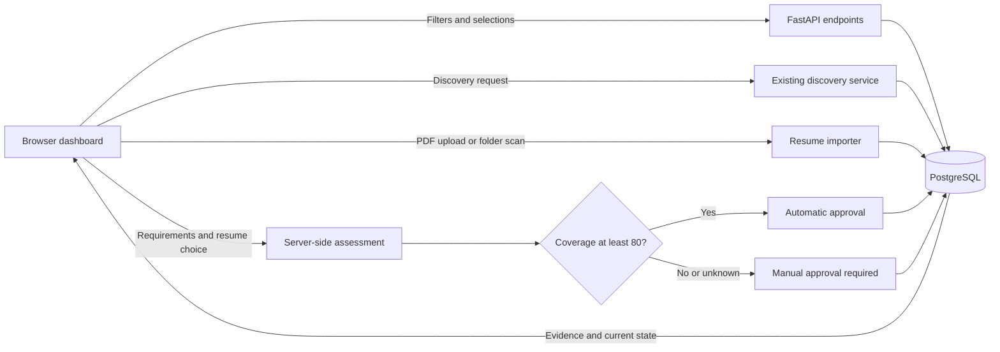
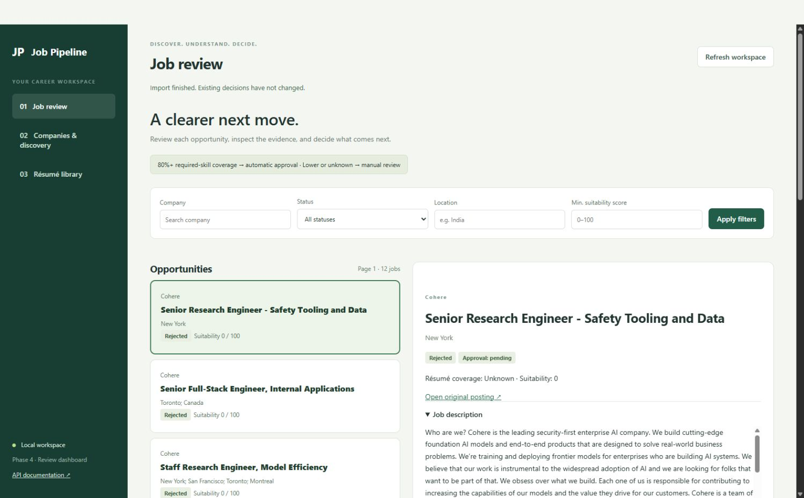

> Current-version note: [Phase 5](PHASE5.md) moves dashboard discovery into the background. The synchronous behavior and verification below describe Phase 4.

# Phase 4 — Review dashboard

[Project overview](../README.md) · [Phase 1](PHASE1.md) · [Phase 2](PHASE2.md) · [Phase 3](PHASE3.md)

Phase 4 provides a browser interface at **http://localhost:8000/** for the existing pipeline. You can review jobs, control discovery, import résumés and record decisions without assembling API requests. The backend still calculates matches and enforces the approval rule.

## What we built and why

| Screen | What it does | Why it exists |
| --- | --- | --- |
| Job review | Filter company, status, location and minimum suitability score; browse 20 jobs per page | Narrow the queue without downloading every job |
| Job detail | Show original posting, stored description, discovery warnings, résumé assessment history and both scores | Explain why a job was selected and what the score actually measures |
| Résumé assessment | Edit explicit required skills, choose a résumé version or the best matching version, reassess | Let you correct ambiguous source requirements and compare the intended résumé |
| Decision controls | Change tracking status and record manual approval | Keep application progress and human decisions in one place |
| Companies & discovery | Search imported companies, select up to five, choose job limit/offset, run discovery or source checks | Control the existing bounded discovery process from the browser |
| Coverage and run history | Flag missing workbook profiles/URLs, display the latest 20 runs, errors and continuation offsets | Distinguish coverage problems from a genuinely empty search |
| Résumé library | Upload a PDF, rescan the local folder, list filename/content versions and per-file results | Add a new résumé without restarting the service or using PowerShell |

The UI includes loading, empty and error states, disabled controls while requests are in progress, keyboard-accessible native forms, visible focus indicators and a responsive layout. Job descriptions and API data are inserted as text, not executable HTML. Source links accept only HTTP(S).

## Technologies and alternatives

- **HTML** provides the page structure, labels and forms.
- **CSS** provides the sidebar, responsive layout and visual states.
- **Plain JavaScript and fetch** call the existing APIs, display results and handle input. No frontend build process or Node service is required to run it.
- **FastAPI StaticFiles/FileResponse** serves the dashboard from the same host as the API. This avoids a separate web server and cross-origin configuration.
- **Python, SQLAlchemy and PostgreSQL** remain responsible for all validation, matching and stored decisions. The UI never supplies an automatic-approval flag or computed score.
- **pytest** covers the dashboard routes and the preserved approval gate. The existing suite still checks imports, matching, migrations and PostgreSQL behavior.

React/Vue could provide reusable components for a larger UI, but would introduce another dependency/build workflow. Jinja templates plus HTMX would be another lightweight option. This phase uses plain browser technologies to keep the project beginner-friendly; no new Python dependency is needed.

## Data flow



## Files and schema

```text
app/static/index.html       Page structure and three views
app/static/style.css        Layout, colors and responsive rules
app/static/app.js           API requests, form handling and rendering
app/main.py                 Static serving and single-job read endpoint
tests/test_dashboard.py     Dashboard route and approval regression tests
docs/PHASE4.md              This guide
```

New read endpoint: `GET /dashboard/jobs/{job_id}`. This returns the existing 12-field job response even when a changed status removes that job from the active list filter. All mutations reuse existing endpoints. **No database migration is needed**: the schema stays at revision `0003` from Phase 3. Docker already copies the entire `app/` directory, so the dashboard is included in the existing API image.

## Start or upgrade — exact PowerShell commands

```powershell
Set-Location 'D:\OFFICIAL WORK\PROJECTS\Somnath Da\Job_Pipeline'
if (-not (Test-Path .env)) { Copy-Item .env.example .env }
docker compose config --quiet
docker compose up --build -d --wait
docker compose ps
Invoke-RestMethod 'http://localhost:8000/health'
Start-Process 'http://localhost:8000/'
```

If Docker Desktop is stopped, open it first. Existing jobs, résumé versions and workbook data remain in the PostgreSQL volume. When changing static files, rebuild the container and reload the browser. API documentation remains at `/docs`. For a fresh database, import companies and the tracker using the Phase 1 commands before discovery; workbook editing/import controls are not part of this screen.

## How to use the dashboard

1. **Résumé library:** choose a PDF and click Upload résumé, or put PDFs in `resume/` and click Scan resume folder. Identical content is skipped. A changed file becomes a separate version. Imported text stays in the local database.
2. **Companies & discovery:** search and select 1–5 companies. Set a limit of 1–300 jobs per company, then Discover jobs. Keep the page open while the synchronous request completes. Check career sources resolves selected URLs without creating jobs.
3. Inspect the run result. If it gives a continuation offset, select that company alone and use the displayed offset for the next request. Missing workbook rules must be corrected in Excel and reimported.
4. **Job review:** apply filters, then select a job. Read its description, open the original posting if necessary, and expand the explanations/history.
5. Enter accurate required skills as comma-, semicolon- or newline-separated items. Choose the intended résumé (or best matching version), then Save requirements & reassess.
6. To approve manually, select Approved, check “I have reviewed and manually approve this job,” and Save decision. For an automatically approved job, the manual checkbox stays unchecked unless you deliberately record a human review.

The minimum-score filter is **Phase 2 suitability**, not résumé coverage. Phase 3 coverage remains textual required-skill coverage, not a semantic percentage of the entire job or a hiring probability. An available score of at least 80 automatically approves; below 80 or unknown requires manual approval. Reassessment can remove automatic approval if the score drops, and can reconsider a Rejected job. Human approvals and later application outcomes follow the preservation behavior described in [Phase 3](PHASE3.md).

No button submits applications. This remains a local single-user app without authentication. Discovery is synchronous; background workers, scheduled runs and notifications belong to Phase 5. The page does not yet provide résumé deletion, PDF preview, manual job creation or Excel editing; existing APIs remain available for creation/imports. Unsaved form edits are not persisted across reloads.

## Verification

```powershell
docker compose run --rm -e TEST_POSTGRES=1 api python -m pytest -q -p no:cacheprovider
docker compose logs --tail 50 api
```

Verified on 2026-09-27: **102 tests passed** across SQLite and isolated PostgreSQL schemas. One existing Starlette/AnyIO deprecation warning remains. Docker built successfully and the API reached healthy status. Browser checks covered job descriptions, filtering through keyboard submission, screen navigation and a folder rescan that reported all four existing PDFs as duplicates. No real job was approved or reassessed merely for testing. Upload/assessment mutations are covered by the existing API tests; this phase does not add a full automated browser test suite.



## Next phases

Phase 5 adds background workers, scheduling, controlled retries and monitoring. Phase 6 adds application preparation and follow-ups. Phase 7 hardens deployment and completes the planned version 1. Optional submission automation remains outside these phases unless separately requested.


## India-focus correction — 2026-09-28

The dashboard now defaults to **India opportunities**: explicit India/city location matches, excluding Rejected and Withdrawn. Choose **Excluded / other locations** for the complementary history view, or **All tracked jobs** to inspect everything. Generic remote locations are not assumed to allow India. This is a location-label filter, not verification of work authorization or every restriction in the description. Filters are applied before pagination. The API retains its backward-compatible all-jobs default; use `GET /jobs?scope=india` or `scope=history` for the dashboard behavior. No records were deleted.

The saved matching profile had API example values (`string`). It was restored to the previously confirmed workbook skills and India locations. Profile updates now reject example placeholders. The résumé threshold policy remains unchanged.

Verification: **106 tests passed** across SQLite and PostgreSQL. Two discovery runs examined nine selected companies. Razorpay and Observe.AI returned 25 and 14 postings respectively; none passed their workbook title rules. Sarvam AI, Postman, MongoDB, BrowserStack, Uniphore and Freshworks did not resolve to a supported board; Sprinto returned HTTP 403. No India opportunities were created by these runs. These failures remain in run history and do not establish that the companies have no India vacancies. Broader provider support or source corrections are needed to improve coverage.

Run IDs: `aec94dd0-3ab0-46cd-9d46-aad93325e38a` and `5813292e-f115-469b-b132-b628068efbfc`.
