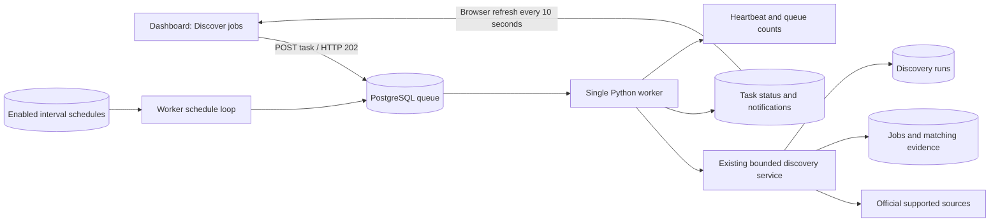
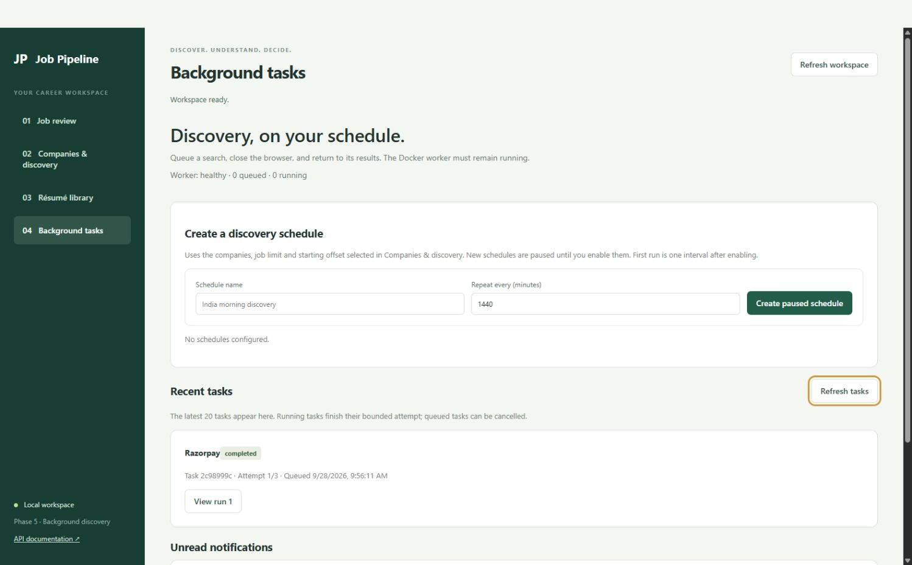

# Phase 5 — Background discovery and schedules

[Overview](../README.md) · [Phase 1](PHASE1.md) · [Phase 2](PHASE2.md) · [Phase 3](PHASE3.md) · [Phase 4](PHASE4.md)

Phase 5 moves dashboard discovery into a persistent queue processed by a separate Python worker. The API accepts a task immediately; the worker can finish it after you close the browser. It also supports opt-in interval schedules, bounded recovery attempts, in-app notifications and worker monitoring.

**No recurring schedules are enabled by this upgrade.** The India default view, company workbook rules, résumé versions and 80% required-skill approval policy remain unchanged. This phase does not add ATS providers or resolve the source-coverage limitations recorded in Phase 4. Background execution does not guarantee new matching jobs.

## What we do and why

| Component | What it does | Why |
| --- | --- | --- |
| PostgreSQL task queue | Stores the company selection, limits, state, attempt count and linked run IDs | Tasks survive browser closure and service restarts |
| Python worker | Claims and executes one task at a time | Long source requests no longer occupy a dashboard HTTP request |
| Schedule loop | Queues due enabled schedules using stored intervals | Supports repeated discovery without leaving a browser open |
| Bounded retry policy | Up to three execution attempts, with 30- and 60-second delays | Recover from execution interruptions without endless retries |
| Startup recovery | Requeues interrupted tasks within their attempt budget; finishes tasks whose run already completed | Preserve committed work and avoid treating API restarts as worker failures |
| Run history | Retains each attempt's run ID and source outcomes | Explain failures, truncation and duplicate counts |
| Local notifications | Records completion, partial results or failure; supports Mark read | Surface outcomes without sending your data to external messaging services |
| Heartbeat and health | Reports worker availability and counts of queued/running tasks | Distinguish an empty queue from a stopped worker |
| Dashboard controls | Queue discovery, inspect tasks/runs, cancel queued tasks, create/pause/enable schedules | Operate the background workflow without writing API calls |

## Technologies and alternatives

We reuse **Python**, **PostgreSQL**, **SQLAlchemy**, **FastAPI**, **Alembic**, **Docker Compose** and the existing browser JavaScript. There are no new pip dependencies or frontend build dependencies.

PostgreSQL stores the queue alongside the project data. Row locks with `FOR UPDATE SKIP LOCKED` make claiming tasks transactional; a PostgreSQL advisory lock restricts production execution to one worker process. A small Python loop checks schedules and available work every five seconds when idle. A separate thread writes a heartbeat every ten seconds, including while discovery is running.

Alternatives include Celery with Redis/RabbitMQ, RQ with Redis, or a dedicated scheduling library. These become useful with many workers, high throughput or richer calendar schedules, but would add services and operational concepts to this beginner project. **n8n is not needed for this phase** because the queue, schedule records and dashboard cover the present workflow. It can be evaluated later for external integrations. No Codex automation is required: this scheduler runs inside your project's Docker worker.

## Data flow



## Task behavior

Tasks move from **queued → running → completed / partial / failed**. An execution exception or interrupted worker may return a task to queued while its attempt budget remains. A queued task can be cancelled; a running task finishes its bounded attempt. Partial means source errors or truncation remain, and is not presented as full success.

- Maximum **3 attempts total** per task. Execution retries wait 30 seconds, then 60 seconds.
- Invalid configuration is terminal. Expected source outcomes such as HTTP 403, unsupported boards, missing company profiles and truncated pages are recorded in the run rather than automatically requeueing the whole task. Existing source-level bounded retries remain in effect.
- **Queue a new attempt** creates a separate task with its own history. Review a permanent source error before using it; repeating a task does not repair the source.
- Each attempt gets a run ID before execution. A validation failure before run creation may leave that attempt without an available run record; its task error still explains the failure.
- Recovery retains committed company outcomes and marks an unfinished linked run interrupted. A completed linked run is finalized without replaying it. Job ID/URL deduplication protects already inserted jobs if a run must be repeated. This is retryable, at-least-once execution, not a guarantee that each source will be contacted exactly once.
- API startup no longer marks every running discovery as interrupted. A worker-owned task can outlive API restart.
- The task stores selected company IDs, limit and offset. At execution, it uses the then-current imported company rules, matching profile and résumé library. The discovery run and résumé assessments retain their own evidence. Changing profiles before execution can therefore affect results.

The legacy `POST /discovery/runs` synchronous API remains available for compatibility; the dashboard now uses `POST /discovery/tasks`. Source audits remain synchronous. Only queued background tasks receive the Phase 5 restart/retry behavior.

## Schedule behavior

Schedules repeat every **15–10,080 minutes** (up to seven days); the default is 1,440 minutes. The dashboard creates them **paused**. Enabling a schedule sets its first due time to now plus its interval. This is an interval schedule, not “every day at 09:00 Asia/Kolkata.” Timestamps are timezone-aware; the browser displays local time.

When a schedule is due, the worker queues at most one task if that schedule has no queued or running task. It moves the next due time to the current time plus the interval. Missed occurrences while Docker was stopped are coalesced into one, never a large catch-up backlog. A busy single worker may enqueue late; this is not a precise real-time scheduler. Separate schedules or manual tasks may target the same company; database job deduplication still applies.

Pausing prevents future enqueueing. It does **not** cancel an existing queued or running task; cancel queued tasks separately. To change a schedule's company selection, interval or offset, pause the old schedule and create a new one. Historical schedule/task records are retained.

## Database and files

Alembic migration **0004** adds `background_tasks`, `discovery_schedules`, `notifications` and `worker_state`. Existing tables and tracker fields are preserved. The pre-upgrade local backup is `backups/phase4-before-phase5.dump` (excluded from Git).

```text
app/background.py          Queue claiming, scheduling, recovery and execution
app/worker.py              Worker process, exclusive lock and heartbeat
app/automation_routes.py   Tasks, schedules, notifications and health APIs
app/static/automation.js   Background dashboard controls and polling
migrations/versions/0004_background_discovery.py
tests/test_background.py   Queue, retry, schedule, recovery and concurrency tests
```

Compose now runs three services: **db**, **api**, **worker**. API startup runs migrations; the worker waits for API health before starting. Both Python services build from the same Dockerfile. The worker needs no workbook/PDF mount because discovery reads imported rules and résumé text from PostgreSQL. Imports continue through the API.

## Start or upgrade — PowerShell

```powershell
Set-Location 'D:\OFFICIAL WORK\PROJECTS\Somnath Da\Job_Pipeline'
if (-not (Test-Path .env)) { Copy-Item .env.example .env }
docker desktop start
docker compose config --quiet
docker compose up --build -d --wait
docker compose ps
Invoke-RestMethod 'http://localhost:8000/health'
Invoke-RestMethod 'http://localhost:8000/worker/health'
Start-Process 'http://localhost:8000/'
```

For a future upgrade, back up the running database first. This avoids PowerShell binary-output redirection:

```powershell
New-Item -ItemType Directory -Force backups | Out-Null
docker compose exec -T db sh -c 'pg_dump -U "$POSTGRES_USER" -d "$POSTGRES_DB" -Fc -f /tmp/before-upgrade.dump'
docker compose cp db:/tmp/before-upgrade.dump backups/before-upgrade.dump
```

Backup restore instructions remain in the Phase 2 guide. There is no destructive migration downgrade; restore a backup to return to an earlier schema. Never use `docker compose down --volumes` unless intentionally deleting database data.

## Use the dashboard

1. In **Companies & discovery**, select up to five companies and choose the existing limit/offset.
2. Click **Discover jobs**. A queued task ID is returned immediately; you can close the page.
3. Open **Background tasks** to see worker health, the latest 20 tasks and unread notifications. **View run** shows source results and continuation offsets. The page polls every ten seconds while visible; it does not create runs by polling.
4. For a recurring search, keep the desired company selection, open Background tasks, enter a name and interval, and **Create paused schedule**. Enable it explicitly when ready.
5. Use **Pause schedule**, **Cancel queued task**, or **Mark read** as appropriate. Notifications are stored locally; there are no emails, Slack messages or browser push notifications.

## API examples — PowerShell

Queue one selected company (choose its actual ID from the company list):

```powershell
$base = 'http://localhost:8000'
$companies = Invoke-RestMethod "$base/companies?limit=500"
$companies | Select-Object id, name
$companyId = 335 # Existing Razorpay ID in this workbook import; verify for your database.
$body = @{ company_ids = @($companyId); max_jobs_per_company = 100; job_offset = 0 } | ConvertTo-Json
$task = Invoke-RestMethod -Method Post "$base/discovery/tasks" -ContentType 'application/json' -Body $body
Invoke-RestMethod "$base/discovery/tasks/$($task.id)"
Invoke-RestMethod "$base/discovery/tasks?limit=20&offset=0"
Invoke-RestMethod "$base/notifications"
```

Create a paused schedule, then enable or pause it deliberately:

```powershell
$body = @{
    name = 'India daily discovery'
    interval_minutes = 1440
    enabled = $false
    discovery = @{ company_ids = @($companyId); max_jobs_per_company = 100; job_offset = 0 }
} | ConvertTo-Json -Depth 4
$schedule = Invoke-RestMethod -Method Post "$base/discovery/schedules" -ContentType 'application/json' -Body $body
# Optional: enable recurring runs, first due one interval from now.
Invoke-RestMethod -Method Patch "$base/discovery/schedules/$($schedule.id)" -ContentType 'application/json' -Body '{"enabled":true}'
# Pause future enqueueing.
Invoke-RestMethod -Method Patch "$base/discovery/schedules/$($schedule.id)" -ContentType 'application/json' -Body '{"enabled":false}'
```

Cancel only a queued task:

```powershell
Invoke-RestMethod -Method Post "$base/discovery/tasks/$($task.id)/cancel"
```

This returns HTTP 409 if already running or finished. All task/schedule payloads reuse the Phase 2 limits. Task list pagination is 1–100 records; schedule lists are 1–500. `GET /notifications?unread_only=false` includes read notices; mark one read with `POST /notifications/{id}/read`.

## Monitoring and shutdown

```powershell
docker compose logs --tail 100 worker api
docker compose run --rm -e TEST_POSTGRES=1 api python -m pytest -q -p no:cacheprovider
docker compose stop worker
docker compose start worker
docker compose down
```

`GET /worker/health` returns `healthy` when the persisted heartbeat is less than 45 seconds old, otherwise `offline`, together with task counts. It is an informational JSON endpoint; `/health` remains the API/database health check. Compose checks the worker's heartbeat file. A heartbeat indicates process/database liveness, not that an external source is responding successfully.

Graceful worker shutdown waits for the current bounded discovery attempt (Compose allows ten minutes). A forced kill triggers recovery on the next start. If your computer sleeps, shuts down, or Docker stops, discovery cannot run until it resumes. Production worker locking requires PostgreSQL; SQLite is used only for isolated tests. The current design intentionally supports one worker, not horizontal worker scaling or high-volume crawling.

## Verification and next steps

Tests cover queue validation, cancellation, exclusive claims, retry backoff and exhaustion, non-retryable source/configuration errors, interrupted-run recovery, completed-run recovery, opt-in schedules, missed-interval coalescing, pause/resume, notifications and heartbeat state. PostgreSQL tests additionally exercise skipping a row locked by another session. Phase 1–4 regression tests remain included.

Final verification on 2026-09-28: **127 tests passed, 1 skipped** across SQLite and PostgreSQL. The skipped case is PostgreSQL row locking on SQLite; its PostgreSQL counterpart passed. One existing Starlette/AnyIO deprecation warning remains. Docker configuration validated. Browser checks confirmed the Background tasks view, healthy worker status, completed task, linked run results and unread notification; no JavaScript errors were reported during that check.



Live smoke task `2c98999c-636c-404a-9fbf-3a82cc205225` queued and completed in one worker attempt, linked to run `89822e2a-d44e-4366-bd13-e1becd50abc2`, and generated an unread local notification. It fetched Razorpay's 25 postings; none matched the existing workbook role rules, so it created no jobs. No recurring schedules were created or enabled during verification. The database backup was saved before migration, and all three Compose services became healthy.

Next: **Phase 6 application preparation and follow-ups**. Phase 7 adds authentication, deployment hardening and broader operational checks. Optional application submission remains separately scoped. Source coverage needs its own improvements; scheduling the existing connectors does not expand what they can read.
