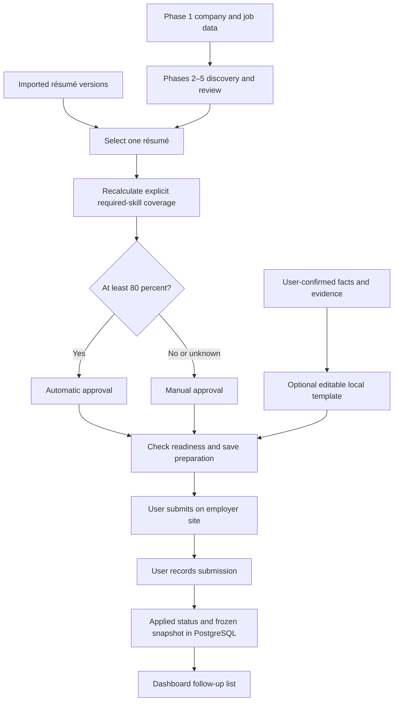
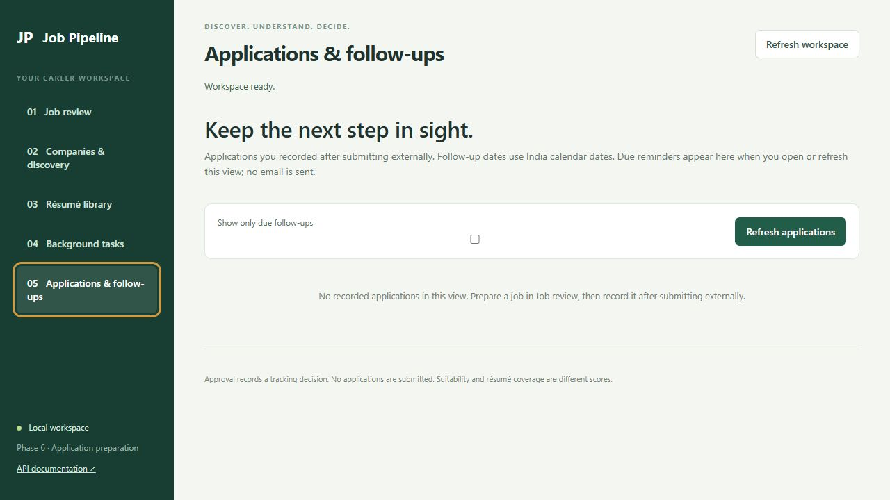

# Phase 6 — Application preparation and follow-ups

Current-version note: [Phase 7](PHASE7.md) adds required sign-in. Add the authentication headers documented there when using this guide's API examples. The Phase 6 workflow and historical verification below are preserved.

Phase 6 turns a reviewed opportunity into a saved preparation and a record of an application you submitted yourself. Phases 1–5 remain available. The original 12 tracker API fields stay unchanged; migration `0005` adds a separate `application_preparations` table.

## What happens and why

1. Open a job in **Job review** and select an imported résumé in **Application preparation**. Saving recalculates coverage for that exact version. A score from a different résumé cannot satisfy this preparation's approval check.
2. Confirm practical readiness: the posting is open, you meet location/work eligibility, and the selected résumé and other documents are ready. These are checklist items, separate from manual approval. A résumé covering **80% or more** of explicit required skills needs no manual approval. Lower or unknown coverage needs the existing manual approval control and Approved status.
3. Optionally enter facts and evidence, one `fact | evidence` per line, and confirm they are accurate. For example, `Built a Python API | Portfolio README`. The system stores your confirmation; it does not independently verify the claim. Facts belong to this preparation and are not silently shared across applications.
4. Save, then optionally choose **Make template from saved facts**. This creates editable text using the role, company and your confirmed facts. It adds no inferred skills, years of experience or invented achievements. Edit and save to retain the draft. Creating a template alone does not save or send it.
5. Submit on the employer's site yourself, using the original PDF. Then confirm that you submitted, choose the actual date/channel, optionally add a confirmation reference and follow-up date, and click **Record application**. The server checks readiness again, sets the job to Applied, and freezes the selected résumé, requirements, score, approval method, checklist, facts, draft and notes.
6. Open **Applications & follow-ups** to see these records. Filter to due follow-ups, open an application, change/remove its follow-up date, or mark it completed. Continue updating Interview, Rejected, Offer or Withdrawn through the existing tracking status control.

One application record is allowed per job. Recording twice returns a conflict. Submitted preparation is read-only; subsequent job edits do not rewrite its snapshot. Follow-up date/completion remain editable. Reapplications and correcting a submission record need a later audited amendment workflow.

## Data flow



The application never visits an employer form or sends a message in this flow. Approval and readiness are distinct: automatic approval does not prove the vacancy is open or that location/work authorization is suitable. India remains the default discovery view; preparation does not infer eligibility from a location string.

## Files and technology choices

| Part | Responsibility | Why this choice / other options |
| --- | --- | --- |
| `app/applications.py` | Validated preparation, draft, submission and follow-up APIs | FastAPI and Pydantic extend the existing app; Django or Flask would require another application structure |
| `app/models.py` | Preparation linked to one job and résumé | PostgreSQL and SQLAlchemy preserve durable records and use a job row lock to serialize writes; a spreadsheet would make concurrent updates and snapshots harder |
| `migrations/versions/0005_application_preparation.py` | Add the new table and follow-up date index | Alembic upgrades without rebuilding the tracker; manually changing tables is harder to reproduce |
| `app/static/applications.js` | Preparation forms and application list | Plain JavaScript fits the current dashboard; React/Vue could help with a larger interface but add a build system |
| Local text template | Optional draft assistance | Deterministic, no API key or external disclosure; an LLM is a later option with claim validation and evaluation |
| Date-based dashboard query | Show pending follow-ups due today or earlier | Simple and durable; email, push notifications or n8n would need separate delivery configuration and authorization |
| pytest | Approval boundaries, snapshots, validation and database integration | Exercises actual endpoints against SQLite and isolated PostgreSQL schemas |

No new runtime dependencies or Docker services are required. Existing API, PostgreSQL and discovery worker containers continue to run. The worker handles discovery; follow-up visibility is calculated by the API when the dashboard requests it.

## API

| Method and path | Purpose |
| --- | --- |
| `GET /jobs/{job_id}/preparation` | Saved preparation plus freshly calculated readiness and blockers |
| `PUT /jobs/{job_id}/preparation` | Replace the unsent preparation and assess its selected résumé |
| `POST /jobs/{job_id}/preparation/draft` | Return an unsaved template from saved confirmed facts |
| `POST /jobs/{job_id}/application` | Confirm an external submission, freeze its snapshot and set Applied |
| `GET /applications?due_only=true&limit=50&offset=0` | List due follow-ups; omit `due_only` to list all recorded applications |
| `PATCH /jobs/{job_id}/follow-up` | Set/remove date and mark complete/reopen |

`PUT` replaces the entire preparation; omitted optional values reset to defaults. Save your draft and notes together. Unknown fields are rejected. Dates use the India calendar, not the container's UTC date. Submission cannot be in the future, and follow-up cannot precede submission. Due follow-ups include only Applied/Interview records, excluding completed follow-ups and terminal job outcomes. No background reminder is sent while the dashboard is closed.

The original tracker can still import historical Applied jobs or update status directly. These do **not** fabricate a Phase 6 submission record and are absent from this application list. Use the Phase 6 workflow for new preparations. Existing historical jobs and approval decisions are not migrated into invented snapshots.

## Start or upgrade in PowerShell

Run from the project directory. Keep Docker Desktop running. If this database has valuable data, take a fresh backup before each upgrade; choose a new filename if preserving an earlier backup.

```powershell
Set-Location 'D:\OFFICIAL WORK\PROJECTS\Somnath Da\Job_Pipeline'
if (-not (Test-Path .env)) { Copy-Item .env.example .env }
docker desktop start
docker compose up -d db
New-Item -ItemType Directory -Force backups | Out-Null
docker compose exec -T db sh -c 'pg_dump -U "$POSTGRES_USER" -d "$POSTGRES_DB" -Fc -f /tmp/phase5-before-phase6.dump'
docker compose cp db:/tmp/phase5-before-phase6.dump backups/phase5-before-phase6.dump
docker compose config --quiet
docker compose up --build -d --wait
docker compose ps
Invoke-RestMethod 'http://localhost:8000/health'
Invoke-RestMethod 'http://localhost:8000/worker/health'
Start-Process 'http://localhost:8000/'
```

The API runs migrations before startup. Backups are excluded from Git. PostgreSQL binary dumps are copied with Docker rather than redirected through PowerShell. Restore procedures are in the Phase 2 guide; Phase 7 will add restore drills and deployment hardening.

API example, using an existing job and an imported résumé. Replace `YOUR_JOB_ID`; select the intended résumé from the returned list rather than assuming the first version is suitable.

```powershell
$base = 'http://localhost:8000'
Invoke-RestMethod "$base/resumes" | Format-Table
$jobId = [uri]::EscapeDataString('YOUR_JOB_ID')
$resumeId = 'PASTE_RESUME_ID'
$body = @{
    resume_id = $resumeId
    checklist = @{ posting_open = $false; location_eligible = $false; documents_ready = $false }
    verified_facts = @()
    draft = ''
    notes = ''
} | ConvertTo-Json -Depth 6
Invoke-RestMethod -Method Put "$base/jobs/$jobId/preparation" -ContentType 'application/json' -Body $body
Invoke-RestMethod "$base/jobs/$jobId/preparation"
Invoke-RestMethod "$base/applications?due_only=true"
```

Set each checklist item true only after checking it. Use the dashboard to record an actual submission after applying; the example intentionally creates only a preparation.

Tests and logs:

```powershell
.\.venv\Scripts\python.exe -m pytest -q -p no:cacheprovider
docker compose run --rm -e TEST_POSTGRES=1 api python -m pytest -q -p no:cacheprovider
docker compose logs --tail 80 api worker
```

The Docker test command includes the SQLite suite and isolated PostgreSQL schemas. It does not create test applications in your live tables.

## Limits and next phase

Implementation verification: 82 local tests passed with 1 SQLite row-lock test skipped; the Docker suite passed 141 tests with that same SQLite-only skip (the PostgreSQL locking counterpart passed). One existing Starlette/AnyIO deprecation warning remains. Compose configuration validated, all three containers became healthy, and the migration applied to the backed-up database. Browser checks verified the preparation form and application list without console errors; submission behavior was tested in isolated test databases, not by changing live jobs.



Coverage is exact skill-text evidence, not proof of proficiency or hiring probability. Unknown requirements remain unknown. Original PDF bytes are not stored in PostgreSQL; keep the files in your résumé folder. Facts are self-confirmed, and freeform edited drafts are not independently fact-checked. This is still a local single-user app without authentication.

Phase 7 is the planned final phase of version 1: authentication, deployment configuration, backup/restore verification, monitoring and full workflow checks. Optional Phase 8 can separately consider assisted submission, after its scope and authorization are agreed. Automatic external submission is not part of Phase 6 or required for version 1.
