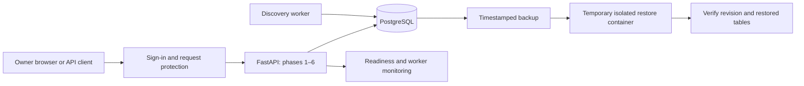

# Phase 7 — Protected operation, deployment and recovery

Phase 7 adds single-owner sign-in, cross-site write protection, readiness and monitoring endpoints, backup tooling, an isolated restore drill, and a separate HTTPS deployment configuration. Phases 1–6 remain available. No database migration is needed: the current schema is still `0005`.

The local implementation is complete. Public deployment is prepared but has not been activated: a server, DNS hostname and HTTPS certificate issuance must be verified on the target host before calling that deployment complete. The Caddy configuration was validated successfully in a temporary container without network access or published ports.

## What each part does and why

| Component | Purpose and reason | Other options |
| --- | --- | --- |
| `app/security.py` | One owner signs in using HTTP Basic; no registration, session database or token storage to maintain | An identity provider with OIDC/MFA is a better next step for multiple users; cookie sessions require login/logout and CSRF token handling |
| Random 32-byte password | Generated locally and kept in ignored `.env`; no hard-coded sign-in secret | A production secret manager or Docker secret files can replace environment configuration |
| Origin checks and trusted hosts | Reject cross-site browser writes and unexpected Host headers; Basic credentials are automatically sent by browsers | SameSite cookies plus CSRF tokens with a session-based login |
| Failed-login throttling | Ten failed credentials from a peer trigger a one-minute cooldown | Shared Redis/proxy limits are needed for multiple API instances |
| `app/operations.py` | Separate database health, migration readiness and worker monitoring | Prometheus/Grafana or external uptime monitoring for historical metrics and alerts |
| Request ID and timing logs | Correlate method/status/duration without logging credentials, request bodies or query strings | OpenTelemetry tracing when the service grows |
| `scripts/backup.py` | Timestamped PostgreSQL custom archives; verify restoration in a disposable, network-isolated PostgreSQL container | Managed database snapshots, encrypted object storage and scheduled backup services |
| `docker-compose.production.yml`, `deploy/Caddyfile` | HTTPS reverse proxy, unpublished API/database ports, non-root read-only app containers and log rotation | Nginx with Certbot, a cloud load balancer, or a managed app platform |
| `scripts/smoke.py` | Read-only checks against the running stack using local credentials | A full browser test runner for larger UI changes |
| pytest | Regression coverage for existing workflows and security boundaries | Additional load/security testing before a larger public service |

Authentication applies to the dashboard, static assets, API documentation, OpenAPI schema and data APIs. Only `/health` and `/ready` are public. Missing/short authentication credentials fail closed; startup requires at least 24 password characters. Production also requires an HTTPS origin, an explicit public hostname, and a database password of at least 24 characters.

Credentials are stored as environment configuration, not in job tables. They are not encrypted by `.gitignore`; keep `.env` private. Single-owner approval now requires the owner's credentials, but this is not a multi-user reviewer audit system.

## Data flow



For public deployment, Caddy terminates HTTPS before traffic reaches FastAPI. The application does not trust forwarded headers; its configured `PUBLIC_ORIGIN` is the authority for browser write origins. Never expose the plain HTTP API port directly on the Internet.

## Start locally — PowerShell

Run from the repository. Existing installations already have `.venv`; on a new machine install Python 3.12 and Docker Desktop first, then create the environment and install dependencies.

```powershell
Set-Location 'D:\OFFICIAL WORK\PROJECTS\Somnath Da\Job_Pipeline'
# New machine only:
py -3.12 -m venv .venv
.\.venv\Scripts\python.exe -m pip install -r requirements.txt

# Safe to repeat: preserves existing database and authentication values.
.\.venv\Scripts\python.exe scripts/setup_local.py
docker desktop start
docker compose up -d db
.\.venv\Scripts\python.exe scripts/backup.py create
docker compose config --quiet
docker compose up --build -d --wait
.\.venv\Scripts\python.exe scripts/smoke.py
Start-Process 'http://localhost:8000/'
```

Your browser prompts for sign-in. The username is `owner` unless changed; find `AUTH_USERNAME` and `AUTH_PASSWORD` in `.env`:

```powershell
notepad .env
```

Do not paste the password into a URL, source code, screenshots or chat. Basic credentials are browser-cached; use a private browser window and close all its windows when finished. There is no custom logout button. Rotate `AUTH_PASSWORD` in `.env` and run `docker compose up -d --force-recreate api` to invalidate old credentials. Use a new random password of at least 24 characters. The setup script fills missing values; it does not rotate an existing password.

Local HTTP is bound to loopback. On a different computer/server, use the HTTPS configuration below. Older phase guides describe their historical unauthenticated API examples; now add authentication to those calls.

## Authenticated API calls — PowerShell 5.1 or 7

This explicitly creates a Basic header, so it works for localhost HTTP without relying on a PowerShell version's authentication switches. Enter the credentials from `.env` at the prompt. Do not print `$headers`.

```powershell
$base = 'http://localhost:8000'
$credential = Get-Credential -UserName 'owner' -Message 'Job Pipeline credentials from .env'
$pair = $credential.UserName + ':' + $credential.GetNetworkCredential().Password
$headers = @{ Authorization = 'Basic ' + [Convert]::ToBase64String([Text.Encoding]::UTF8.GetBytes($pair)) }
Remove-Variable pair
Invoke-RestMethod "$base/health"
Invoke-RestMethod "$base/ready"
Invoke-RestMethod "$base/operations/health" -Headers $headers
Invoke-RestMethod "$base/jobs?scope=india" -Headers $headers
Invoke-RestMethod -Method Post "$base/imports/companies" -Headers $headers
```

All existing import, discovery, approval, résumé and application endpoints use the same credentials. The 80% rule is unchanged. No application submission or message delivery was added.

## Backups and restore verification

```powershell
.\.venv\Scripts\python.exe scripts/backup.py create
$latest = Get-ChildItem .\backups\job-pipeline-*.dump | Sort-Object LastWriteTime -Descending | Select-Object -First 1
.\.venv\Scripts\python.exe scripts/backup.py verify $latest.FullName
```

`create` makes a consistent PostgreSQL dump with a unique timestamped name. `verify` checks the archive type, starts a PostgreSQL 16 container with **no network, published port or persistent volume**, restores with errors treated as failures, checks revision `0005`, and reads company/job/résumé/application counts. It removes only that generated container and its anonymous volumes in a `finally` block. Your live database and saved dump are untouched.

Keep the application release and original `data/` and `resume/` files with your recovery plan. PostgreSQL includes extracted résumé text, not original PDF bytes. Database dumps are sensitive and unencrypted; keep a protected copy on a separate device or encrypted storage. Backup scheduling, offsite replication, retention deletion and email alerts are not automatically enabled. Run a backup before upgrades and regularly while applying, and repeat the restore drill after meaningful changes.

For actual disaster recovery, use the Phase 2 restore guide only after stopping API/worker writes and taking a backup of the current state. The new `verify` command deliberately cannot overwrite the live database. Restoring onto a replacement server should first use a new empty database and the matching application release. Do not use `docker compose down -v` as a routine shutdown: it deletes the data volume.

## Monitoring and tests

| Endpoint | Authentication | Healthy response | Unhealthy response |
| --- | --- | --- | --- |
| `/health` | Public | 200, database reachable | 503 |
| `/ready` | Public | 200, expected migration present | 503 |
| `/operations/health` | Required | 200, database ready and worker heartbeat fresh | 503, degraded/unhealthy |
| `/worker/health` | Required | Existing status, heartbeat and task counts | Still HTTP 200 for compatibility; inspect status |

```powershell
docker compose ps
docker compose logs --tail 80 api worker
.\.venv\Scripts\python.exe scripts/smoke.py
.\.venv\Scripts\python.exe -m pytest -q -p no:cacheprovider
docker compose run --rm -e TEST_POSTGRES=1 api python -m pytest -q -p no:cacheprovider
docker compose stop
```

Docker's API health check uses `/ready`. The operational endpoint treats a worker heartbeat older than 45 seconds as degraded. Request logs show a generated request ID, method, response status and elapsed milliseconds; Uvicorn access logs are disabled to avoid logging private URLs. They are operational logs, not a durable approval audit log. No automatic external alert delivery is configured.

Throttling is in memory and resets on API restart. Behind the HTTPS proxy it conservatively groups requests by the proxy peer, so repeated wrong credentials can briefly block the owner too. This fits one local owner; multi-instance or multi-user operation needs shared limits and stronger identity management.

## HTTPS deployment configuration

Use a server you control with Docker Compose **2.24.4 or newer**, a real domain pointing to it, and inbound ports 80/443. This section prepares deployment; it was not run against a public host during implementation.

On a **new server with an empty PostgreSQL volume**, configure a fresh `.env` with unique strong `AUTH_PASSWORD` and `POSTGRES_PASSWORD` values (at least 24 characters; URL-safe random values avoid connection-string escaping), plus `APP_DOMAIN=jobs.your-domain.example`. Never change just `POSTGRES_PASSWORD` in `.env` on an existing database: PostgreSQL's existing role password will remain unchanged. Plan a database credential rotation or restore into a new database instead.

```powershell
# Run these on the deployment host, in its project directory, after configuring .env.
docker compose -f docker-compose.yml -f docker-compose.production.yml config --quiet
docker compose -f docker-compose.yml -f docker-compose.production.yml up --build -d --wait
docker compose -f docker-compose.yml -f docker-compose.production.yml ps
docker compose -f docker-compose.yml -f docker-compose.production.yml logs --tail 80 proxy api worker
```

The overlay removes host API/database ports and publishes only Caddy on 80/443. Caddy requests and renews certificates for `APP_DOMAIN`. The API/worker run with read-only root filesystems, temporary `/tmp`, dropped capabilities, and no privilege escalation. Container logs rotate at 10 MB with three files. PostgreSQL and Caddy state use persistent volumes.

Before considering the public deployment finished, verify DNS, certificate issuance, HTTP-to-HTTPS redirection, authenticated browser access, cross-origin rejection, backup restore and worker health on that server. The configuration validation performed locally cannot establish any of those external facts. Use the full two-file Compose command for all production upgrades/stops; running only the base file would restore its local port configuration.

## Completion and remaining scope

Verified on 2026-09-30: local suite 96 passed / 1 SQLite-only concurrency skip; full Docker suite 169 passed / the same skip; final security tests 28 passed across SQLite and PostgreSQL. The existing Starlette/AnyIO deprecation warning remains. All three local services became healthy and authenticated smoke checks passed. Both Compose configurations validated, including removal of API/database published ports in production. The restore drill recovered 440 companies, 12 jobs, 4 résumé versions and 0 applications into an isolated container, which was then removed. Live job decisions and approval rules were unchanged.

Version 1 now has implementation for phases 1–7: imports → discovery → matching/approval → dashboard → background discovery → preparation/tracking → protected operation and recovery tools. Phase 7's actual public deployment remains dependent on a target server/domain.

Future work can improve India source coverage and matching evaluation within the existing phases. Multi-user authentication, MFA, shared rate limits, offsite automated backups and richer monitoring are later operational enhancements. Optional Phase 8 would separately define assisted submission; automatic external applications are not part of version 1.
